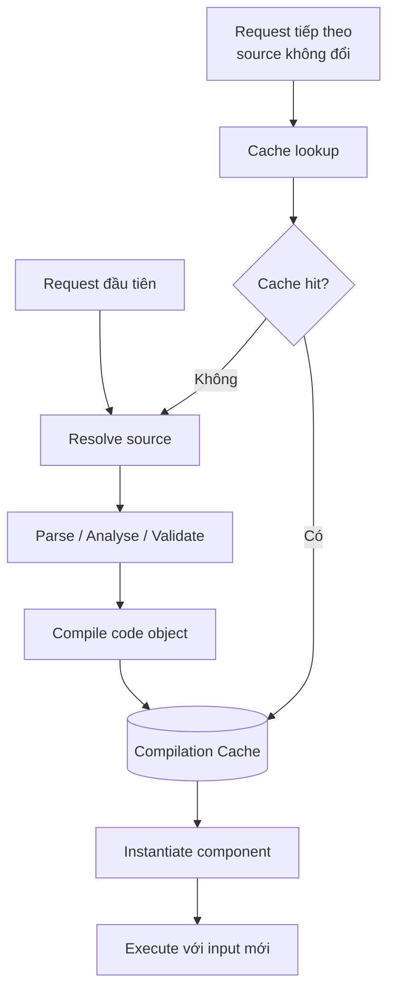
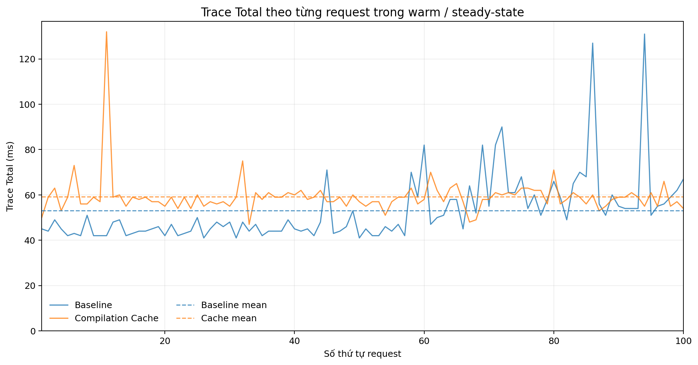
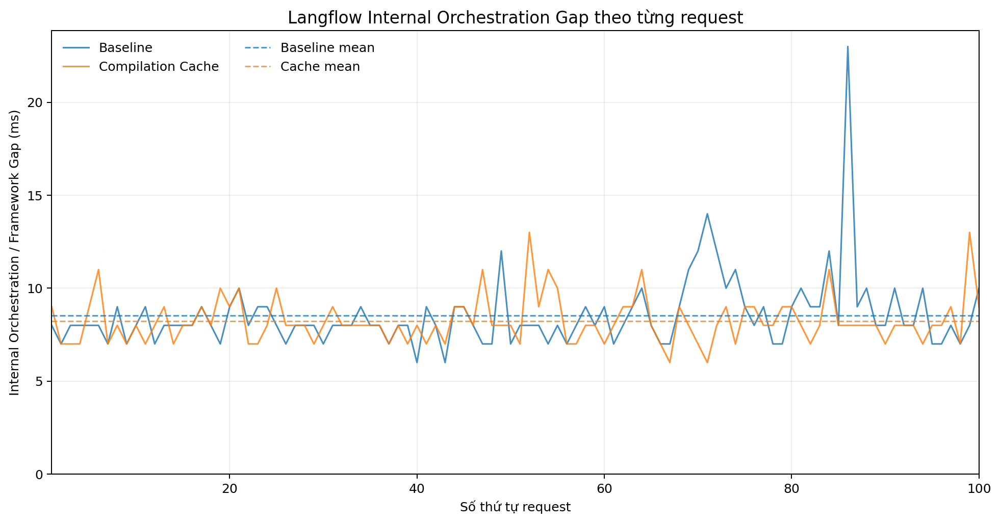
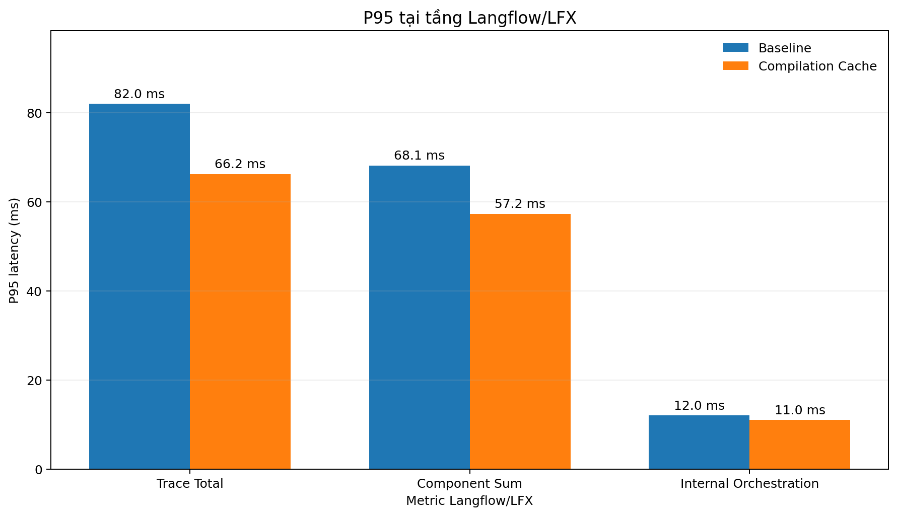
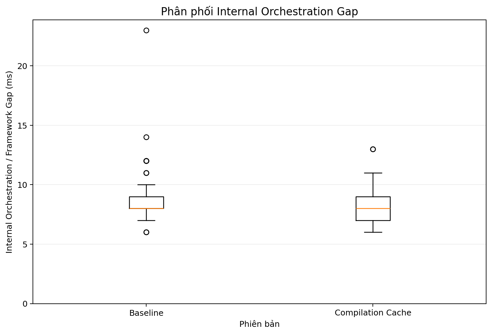

# Kết luận benchmark Langflow Component Compilation Cache

## Tóm tắt điều hành

Benchmark này được thực thi bởi cùng script [`benchmark_langflow.py`](benchmark_langflow.py) để so sánh cùng một Langflow flow sử dụng SCRFD face detection trên hai phiên bản: **Baseline** và **Compilation Cache**. Mỗi phiên bản được restart backend, chạy 5 request warm-up rồi đo 100 request tuần tự. Toàn bộ request tiếp tục sử dụng cùng tập Component definitions; input và output của từng request vẫn được xử lý độc lập.

Kết quả chưa cho thấy Compilation Cache làm giảm đồng đều latency trung bình hoặc P50 của toàn bộ flow. Tuy nhiên, bản cache thể hiện một đặc tính quan trọng cho production: **runtime ổn định hơn, độ phân tán thấp hơn và tail latency P95 tốt hơn tại tầng Langflow/LFX**.

Điều này phù hợp với mục tiêu vận hành của compilation cache. Khi source code của component được giữ nguyên, các request sau warm-up có thể tiếp tục tái sử dụng phần code preparation/compilation đã cache thay vì lặp lại toàn bộ quy trình. Trong một worker sống lâu và phục vụ nhiều request lặp lại, lợi ích cần kỳ vọng không chỉ là giảm latency tuyệt đối mà còn là giảm biến động, hạn chế framework spike và tăng khả năng dự đoán thời gian phản hồi.

> **Kết luận chính:** Dữ liệu hiện tại ủng hộ Compilation Cache theo hướng **ổn định runtime và giảm tail latency**. Đây là tín hiệu tích cực cho workload production kéo dài với component definitions ít thay đổi. Benchmark hiện tại chưa phải concurrent load test, do đó khả năng chịu nhiều request đồng thời vẫn cần được xác nhận bằng một phép đo riêng.

## Bài kiểm tra này thực sự đo gì?

[`benchmark_langflow.py`](benchmark_langflow.py) không phải pure inference benchmark và cũng không chỉ gọi một component đơn lẻ. Script mô phỏng một request gần với hành vi user, đi qua toàn bộ đường xử lý của Langflow:

```text
Đọc cùng một ảnh nguồn vào memory
        ↓
Upload ảnh mới bằng multipart/form-data
POST /api/v1/files/upload/{flow_id}
        ↓
Nhận file_path mới trong Langflow storage
        ↓
POST /api/v1/run/{flow_id}?stream=false
        ↓
Truyền file_path vào đúng Chat Input qua tweaks
        ↓
Chạy toàn bộ SCRFD flow
        ↓
Nhận response
        ↓
Tìm đúng native trace bằng flow_id + session_id + marker
        ↓
Đọc Trace Total và sáu component spans
        ↓
Cleanup file upload ngoài khoảng latency được đo
```

Mỗi request đo ba lớp latency khác nhau:

| Lớp đo | Điểm bắt đầu và kết thúc trong script | Ý nghĩa |
|---|---|---|
| Upload latency | Bao quanh `POST /files/upload/{flow_id}` | Chi phí upload và lưu file theo hành vi user |
| Flow API latency | Bao quanh `POST /run/{flow_id}` | Latency backend từ lúc gọi flow đến khi nhận response |
| User E2E latency | Từ trước upload đến sau response flow | Upload + flow + khoảng client nhỏ giữa hai bước |
| Trace Total | `totalLatencyMs` từ native Langflow trace | Thời gian full-flow bên trong vùng trace của Langflow |
| Component Sum | Tổng sáu component spans được match | Phần execution được giải thích bởi các component |
| Internal Orchestration Gap | `Trace Total - Component Sum` | Khoảng native trace còn lại ngoài tổng component spans |

Trace polling và file cleanup diễn ra **sau** khi User E2E và Flow API timer đã dừng, vì vậy chúng không làm tăng các latency được báo cáo. Cleanup cũng được thực hiện trước request kế tiếp để storage không tích lũy file qua 100 lần chạy.

Đây là một **full-flow, user-like, warm-state latency benchmark**. Nó trả lời câu hỏi:

> Khi cùng một flow và cùng tập Component definitions được thực thi lặp lại tuần tự sau warm-up, hai phiên bản Langflow khác nhau thế nào về latency điển hình, tail latency, độ biến động và phần orchestration/framework?

Nó không trả lời trực tiếp câu hỏi về maximum throughput, concurrent users, saturation point hay pure ONNX inference performance.

## Vì sao phép so sánh hai phiên bản công bằng và hợp lý?

Điểm mạnh của thiết kế A/B là **cùng test harness, cùng workload và cùng cách đo; biến thay đổi có chủ đích là source code của Langflow/LFX execution engine**.

| Yếu tố kiểm soát | Cách script thực hiện | Vì sao quan trọng |
|---|---|---|
| Cùng flow | Một `FLOW_ID` được dùng cho upload, run, trace và cleanup | Hai phiên bản chạy cùng topology và cùng component chain |
| Cùng input | Ảnh được đọc một lần thành cùng `image_bytes` | Loại bỏ khác biệt do kích thước hoặc nội dung ảnh |
| Upload thật ở mọi request | Tạo tên file mới bằng UUID và gọi upload API | Không biến benchmark thành gọi flow với file cũ đã có sẵn |
| Cùng request payload | Cùng `output_type`, `input_type`, Chat Input tweak và `stream=false` | Đảm bảo hai phiên bản nhận cùng dạng công việc |
| Cùng số warm-up | `N_WARMUP = 5` cho cả hai | Giảm ảnh hưởng cold-start trước vùng đo chính |
| Cùng số lần đo | `N_RUNS = 100` | Hai distribution có cùng sample size |
| Thực thi tuần tự | Request sau chỉ bắt đầu khi request trước đã hoàn tất và cleanup xong | Loại queueing/contention khỏi so sánh per-request latency |
| Timer nhất quán | Dùng `time.perf_counter_ns()` cho upload, flow và E2E | Đồng hồ monotonic có độ phân giải cao, phù hợp đo elapsed time |
| Trace được ghép chính xác | Marker riêng cho từng run, session riêng cho benchmark và filter theo `flow_id` | Hạn chế lấy nhầm trace của request khác |
| Component matching nhất quán | Cùng alias map, normalize tên và chọn outer span lớn nhất khi có nhiều match | Hai CSV áp dụng cùng một quy tắc lấy component latency |
| Không đưa polling vào latency | Trace được tìm sau khi response đã nhận | Độ trễ monitor API không làm sai Flow API hoặc User E2E |
| Không đưa cleanup vào latency | File chỉ bị xóa sau flow và trace | Cleanup không làm lợi hoặc gây bất lợi cho một phiên bản |
| Fail-loud ở cấp run | Thiếu trace/span được ghi lỗi; notebook kiểm tra success, HTTP status và component match | Tránh âm thầm coi request lỗi là request nhanh |

Kết quả validation cho thấy cả hai dataset đều có 100/100 request thành công, không có HTTP error, trace thiếu, component span thiếu, run ID trùng hoặc overhead âm. Vì vậy, bảng so sánh không được tạo từ hai tập dữ liệu có chất lượng khác nhau.

### Việc dùng cùng component cũ có thiên vị bản cache không?

Đây là workload có chủ đích, không phải một thiên vị không hợp lệ. Optimization đang được đánh giá là **Component Compilation Cache**, nên repeated execution với component definitions không đổi chính là điều kiện cần để kiểm tra cache có tái sử dụng được phần compilation/preparation hay không.

Điều này cũng không biến bài test thành output cache benchmark:

- mỗi request upload một file mới với tên UUID mới;
- mỗi request nhận `file_path` mới;
- SCRFD preprocess và inference vẫn chạy lại;
- output được tạo lại;
- cache chỉ có thể tái sử dụng phần chuẩn bị mã của component.

Baseline nhận cùng workload lặp lại nhưng không có compilation cache. Do đó, A/B test đặt hai phiên bản trước cùng cơ hội và cùng lượng công việc; điểm khác biệt mong muốn chính là khả năng tránh lặp lại code preparation ở bản cache.

### Điều kiện để kết luận fairness có hiệu lực

Script kiểm soát workload và cách đo, nhưng không tự kiểm soát toàn bộ máy chạy. Kết luận “công bằng” dựa trên điều kiện vận hành đã nêu trong benchmark: cùng máy, cùng model, cùng custom components, cùng ảnh, cùng Flow ID, cùng cấu hình, cùng phương pháp restart và chỉ thay source LFX.

Vẫn còn các nguồn nhiễu mà script chưa ghi nhận trực tiếp:

- hai phiên bản được chạy ở hai thời điểm khác nhau thay vì interleaved/randomized;
- script không tự restart backend và không xác minh commit/version đang chạy;
- chưa ghi CPU, RAM, thermal state, background load hoặc ONNX runtime state;
- chưa có cache hit/miss counter;
- cùng một ảnh giúp so sánh công bằng nhưng chưa đại diện cho nhiều kích thước và độ phức tạp ảnh khác nhau.

Vì vậy, benchmark này **hợp lý và đủ công bằng để so sánh warm-state repeated latency của hai version trong môi trường kiểm soát**, nhưng chưa đủ để thay thế concurrent production load test hoặc chứng minh quan hệ nhân quả tuyệt đối cho mọi thay đổi nhỏ.

## Vì sao workload này phù hợp với compilation cache

Trong cả 100 request, flow tiếp tục sử dụng các component cũ. Cache không lưu output và không bỏ qua inference; nó chỉ có cơ hội tái sử dụng phần chuẩn bị mã khi Component definition không đổi.



Với source code được giữ nguyên, tỷ lệ request có thể đi theo nhánh cache hit được kỳ vọng duy trì cao sau warm-up. Nếu worker không restart và cache không bị invalidation, chi phí chuẩn bị lặp lại không cần thiết có thể được loại khỏi các request sau. Đây là lý do compilation cache có tiềm năng phát huy rõ hơn trong môi trường production chạy lâu và có lượng request lặp lại lớn.

## Kết quả chính tại tầng Langflow/LFX

| Metric | Baseline | Compilation Cache | Nhận xét |
|---|---:|---:|---|
| Trace Total mean | 53.04 ms | 59.23 ms | Cache cao hơn 11.67%; chưa có speedup ở mean |
| Trace Total P50 | 48.00 ms | 59.00 ms | Cache cao hơn 22.92% ở request điển hình |
| Trace Total P95 | 82.00 ms | 66.20 ms | Cache thấp hơn 19.27% ở tail latency |
| Trace Total standard deviation | 15.02 ms | 8.55 ms | Giảm khoảng 43.09% |
| Trace Total CV | 0.283 | 0.144 | Giảm khoảng 49.05% |
| Internal Orchestration mean | 8.54 ms | 8.23 ms | Cache thấp hơn 0.31 ms, tương đương 3.63% |
| Internal Orchestration P50 | 8.00 ms | 8.00 ms | Không thay đổi |
| Internal Orchestration P95 | 12.00 ms | 11.00 ms | Cache thấp hơn 8.33% |
| Internal Orchestration max | 23.00 ms | 13.00 ms | Extreme spike thấp hơn 43.48% |
| Internal Orchestration outlier | 10 | 2 | Giảm 80% theo IQR riêng của từng nhóm |

Khác biệt về phân tán của Trace Total cũng được kiểm tra bằng Brown–Forsythe test và cho `p = 0.00055`. Điều này củng cố nhận định rằng hai phiên bản có độ biến động khác nhau, thay vì chỉ khác do một vài quan sát ngẫu nhiên. Với Internal Orchestration, thay đổi mean/median chưa có ý nghĩa thống kê (`Mann–Whitney p = 0.31`), vì vậy lợi ích ở tầng này nên được mô tả là **giảm spike và cải thiện tail**, không phải speedup trung tâm đã được chứng minh.

## 1. Trace Total trong warm / steady-state



Đường cache tập trung trong một dải hẹp hơn sau spike đầu phiên. Baseline có mean thấp hơn, nhưng xuất hiện nhiều spike lớn hơn ở nửa sau chuỗi request. Vì vậy, biểu đồ không chứng minh cache nhanh hơn về mặt latency trung bình; nó cho thấy cache có **profile dễ dự đoán hơn** trong repeated execution.

So sánh đầu và cuối chuỗi đo cũng hỗ trợ cách đọc này:

| Metric | 10 request đầu | 90 request sau | Chênh lệch |
|---|---:|---:|---:|
| Baseline Trace Total mean | 44.50 ms | 53.99 ms | +9.49 ms |
| Cache Trace Total mean | 58.50 ms | 59.31 ms | +0.81 ms |
| Baseline Orchestration mean | 7.80 ms | 8.62 ms | +0.82 ms |
| Cache Orchestration mean | 8.00 ms | 8.26 ms | +0.26 ms |

Cache Trace Total gần như không drift giữa 10 request đầu và 90 request sau. Đây là tín hiệu phù hợp với giả thuyết rằng khi component definitions được giữ nguyên, trạng thái cache sau warm-up có thể duy trì ổn định trong một worker chạy lâu. Chênh lệch này vẫn chỉ là quan sát trong một lần chạy, không đủ để khẳng định Baseline luôn suy giảm theo thời gian.

## 2. Internal Orchestration / Framework Gap



Hai phiên bản có mean orchestration gần nhau, nhưng Baseline xuất hiện các framework spike cao hơn. Giá trị lớn nhất giảm từ 23 ms xuống 13 ms ở bản cache. Với hệ thống production, giảm các spike loại này có thể quan trọng hơn một mức cải thiện mean nhỏ, vì spike làm tăng độ khó khi đặt timeout, lập kế hoạch capacity và duy trì latency SLO.

Không nên diễn giải toàn bộ `Trace Total - Component Sum` là overhead thuần của Langflow so với pure Python. Metric này chỉ đại diện cho khoảng native trace chưa được giải thích bởi tổng component spans.

## 3. P95 tại tầng Langflow/LFX



P95 của cả ba metric nội bộ đều thấp hơn ở bản Compilation Cache:

- Trace Total: 82.00 → 66.20 ms, giảm 19.27%.
- Component Sum: 68.15 → 57.25 ms, giảm 15.99%.
- Internal Orchestration: 12.00 → 11.00 ms, giảm 8.33%.

P95 tốt hơn cho thấy bản cache giảm thời gian của nhóm request chậm ở phía trên distribution. Trong production, đây là tín hiệu đáng chú ý vì trải nghiệm và SLO thường bị chi phối bởi tail latency, không chỉ bởi mean.

## 4. Phân phối Internal Orchestration Gap



Median của hai phiên bản đều là 8 ms. Điểm khác biệt có lợi cho cache nằm ở phần cực trị: Baseline có outlier lên tới 23 ms, trong khi cache dừng ở 13 ms. Boxplot vì vậy hỗ trợ kết luận **cache không làm dịch chuyển rõ latency trung tâm nhưng hạn chế các framework spike nghiêm trọng**.

Số outlier được tính bằng IQR riêng cho từng distribution nên chỉ dùng như bằng chứng mô tả. Bằng chứng ổn định đáng tin cậy hơn là sự kết hợp của standard deviation, CV, P95, max và hình dạng distribution.

## Ý nghĩa dự kiến trong môi trường production

Production thường khác benchmark ngắn ở ba điểm: worker sống lâu hơn, cùng component definitions được gọi lặp lại nhiều hơn và yêu cầu về tail latency chặt hơn. Trong điều kiện đó, Compilation Cache có cơ sở để mang lại giá trị vận hành theo các hướng sau:

1. **Duy trì cache hit sau warm-up.** Khi source không thay đổi, request mới có thể tái sử dụng phần code preparation đã cache.
2. **Giảm biến động framework.** Dữ liệu cho thấy standard deviation, CV, P95 và extreme spike thấp hơn.
3. **Tăng khả năng dự đoán.** Runtime ổn định giúp đặt timeout, capacity budget và SLO ít phụ thuộc vào các spike ngẫu nhiên.
4. **Có thể giảm công việc lặp lại khi traffic kéo dài.** Khi số request tăng nhưng component definitions giữ nguyên, chi phí compile/prepare lặp lại là phần phù hợp để loại bỏ bằng cache.

Từ các kết quả này, cách diễn đạt phù hợp là:

> Compilation Cache tạo ra một execution profile ổn định hơn cho repeated warm-state workload. Nếu production duy trì worker lâu, có tỷ lệ cache hit cao và sử dụng cùng component definitions, lợi ích về tail latency và tính dự đoán được kỳ vọng tiếp tục phát huy khi số request tăng.

Không nên viết rằng cache đã được chứng minh tăng throughput hoặc xử lý concurrent request tốt hơn. Benchmark hiện tại chạy tuần tự và chưa đo cache contention, thread safety, per-worker cache warm-up hoặc hành vi khi scale-out.

## Những điểm chưa được chứng minh

- Chưa có concurrent load test hoặc stress test.
- Chưa đo throughput, requests/second hay saturation point.
- Chưa có trường cache hit/miss để xác nhận trực tiếp từng request sử dụng cache.
- Chưa tách thời gian compile/prepare thành native span riêng.
- Mỗi worker/process production có thể cần warm-up cache riêng.
- Restart, deployment hoặc thay đổi Component source có thể làm mất hoặc invalidate cache.
- SCRFD inference mean thay đổi giữa hai lần chạy dù đây không phải mục tiêu của compilation cache; biến động này làm Trace Total mean của bản cache cao hơn.

## Kết luận cuối cùng

Component Compilation Cache chưa tạo ra speedup đồng đều trên latency trung bình trong benchmark hiện tại. Trace Total mean và P50 của bản cache vẫn cao hơn Baseline, chủ yếu do Component Sum và SCRFD inference tăng trong lần đo này.

Tuy nhiên, xét theo góc độ vận hành Langflow/LFX, bản cache cho thấy một profile tích cực hơn về độ ổn định: Trace Total standard deviation giảm khoảng 43%, CV giảm khoảng 49%, Trace P95 giảm khoảng 19%, Orchestration P95 giảm khoảng 8% và extreme orchestration spike giảm từ 23 xuống 13 ms. Cache cũng duy trì Trace và Orchestration gần như không drift giữa 10 request đầu và 90 request sau.

Vì toàn bộ request tái sử dụng cùng tập Component definitions, kết quả này phù hợp với cơ chế mong đợi của compilation cache: sau warm-up, phần chuẩn bị mã có thể tiếp tục được dùng lại miễn là source không thay đổi. Trong production với worker sống lâu và traffic lặp lại, **giảm biến động và giảm tail latency có thể là lợi ích thực tế quan trọng hơn một mức giảm nhỏ ở latency trung bình**.

Do đó, bản cache nên được đánh giá là **có triển vọng cho production về tính ổn định và khả năng dự đoán**, nhưng cần một vòng benchmark concurrent riêng trước khi khẳng định lợi ích về throughput hoặc khả năng xử lý nhiều request đồng thời.

## Bước xác nhận tiếp theo

Để chuyển từ “tín hiệu production tích cực” sang “bằng chứng production”, benchmark tiếp theo nên:

1. Chạy các mức concurrency 1, 5, 10, 20 và 50.
2. Lặp lại mỗi cấu hình qua nhiều backend restart.
3. Ghi cache hit/miss và compile/preparation latency thành native spans.
4. Báo cáo throughput, P50, P95, P99, error rate và saturation point.
5. Kiểm tra riêng single worker, multi-worker và scale-out để xác định cache được chia sẻ ở phạm vi nào.
