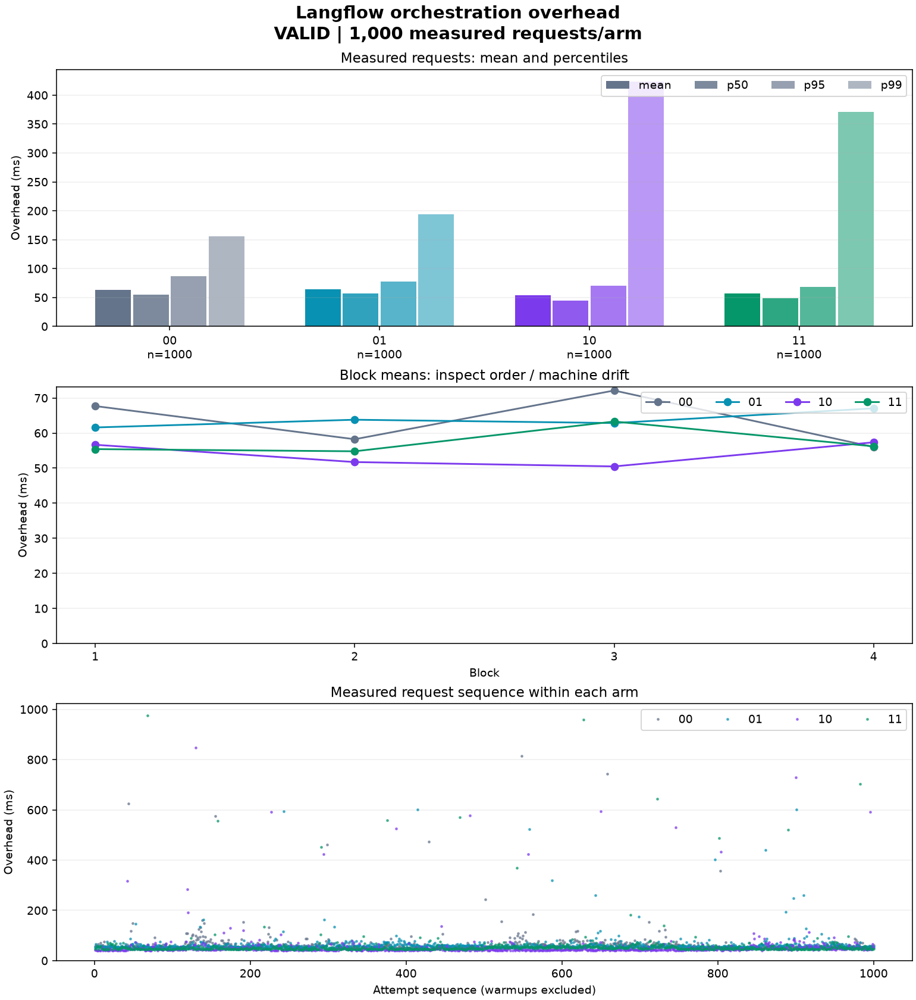

# Overhead điều phối Langflow / SCRFD

**VALID · CAMPAIGN — 1.000 request đo/arm**

Experiment: main-v2

langflow_overhead_ms = server_total_ms - scrfd_processing_ms. server_total_ms là wall-clock trong worker từ điểm vào middleware benchmark của /run đến khi gửi xong response body. scrfd_processing_ms là độ dài hợp các khoảng output method của bốn node SCRFD, không cộng hai lần phần chồng lấn. Upload, tải ảnh kết quả và toàn bộ xử lý SCRFD nằm ngoài chỉ số chính. Chat Input/Output, tạo graph/component, validation, auth bên trong middleware và serialize response vẫn được tính. Đây không phải CPU time hay latency end-user.

Ranh giới ghi trong manifest: Outer application ASGI entry through final response body send, including all Langflow middleware and HTTP telemetry, excluding post-response background work, minus union of SCRFD output method bodies

## Tính hợp lệ

Đủ số mẫu theo manifest; output, timing, cờ và counter trong worker đều đạt kiểm tra.

## Thiết kế và cách đọc

Arm có bit thứ nhất = compilation cache, bit thứ hai = warm graph registry; 1 bật, 0 tắt. HTTP connection reuse tắt ở mọi arm. Mỗi slot dùng một worker độc lập, concurrency 1. Thiết kế khai báo 1000 mẫu đo/arm, bốn block, 5 warmup/slot. Warmup không đi vào thống kê độ trễ.

p50/p95/p99 dùng nội suy tuyến tính (Hyndman-Fan type 7). Mỗi request có trọng số bằng nhau; các block cân bằng nên mean tổng hợp cũng bằng mean của các mean block. Các percentile mô tả phân phối mẫu, không phải khoảng tin cậy.

## Chỉ số chính: Langflow overhead (ms)

| Arm | Đã thử | Output hợp lệ | n timing | Mean | p50 | p95 | p99 |
| --- | --- | --- | --- | --- | --- | --- | --- |
| 00 | 1000 | 1000 | 1000 | 63.528 | 55.177 | 86.800 | 156.122 |
| 01 | 1000 | 1000 | 1000 | 63.828 | 57.180 | 77.953 | 193.858 |
| 10 | 1000 | 1000 | 1000 | 54.065 | 44.675 | 70.277 | 423.070 |
| 11 | 1000 | 1000 | 1000 | 57.437 | 48.979 | 68.610 | 370.681 |



## Hiệu ứng trên mean overhead

Δ = mean bật - mean đối chứng: âm nghĩa là overhead thấp hơn trong lần chạy này. Giảm (%) = (đối chứng - bật) / đối chứng x 100; âm nghĩa là chậm hơn. Không mặc định cache hoặc kết hợp hai cache luôn nhanh hơn.

| So sánh | Δ ms | Giảm % |
| --- | --- | --- |
| 01 - 00 | 0.300 | -0.472 |
| 10 - 00 | -9.463 | 14.896 |
| 11 - 00 | -6.091 | 9.588 |
| Compilation khi warm OFF (10 - 00) | -9.463 | 14.896 |
| Compilation khi warm ON (11 - 01) | -6.391 | 10.013 |
| Warm khi compilation OFF (01 - 00) | 0.300 | -0.472 |
| Warm khi compilation ON (11 - 10) | 3.372 | -6.236 |

Tương tác μ11 - μ10 - μ01 + μ00 = **3.072 ms**. Giá trị âm cho thấy mức giảm kết hợp lớn hơn tổng hai mức giảm riêng theo thang ms.

Không báo CI hay p-value. Chỉ có bốn block độc lập; 4.000 request không phải 4.000 lần lặp độc lập của điều kiện máy. Kết quả là quan sát tại workload, source và máy đã ghi nhận.

## Theo block (chỉ số chính, ms)

| Block | Arm | n | Mean | p50 | p95 | p99 |
| --- | --- | --- | --- | --- | --- | --- |
| 1 | 00 | 250 | 67.703 | 56.329 | 107.735 | 157.396 |
| 1 | 01 | 250 | 61.602 | 56.415 | 74.083 | 140.657 |
| 1 | 10 | 250 | 56.663 | 45.632 | 73.358 | 301.241 |
| 1 | 11 | 250 | 55.427 | 47.169 | 64.021 | 119.387 |
| 2 | 00 | 250 | 58.246 | 52.471 | 69.210 | 101.311 |
| 2 | 01 | 250 | 63.808 | 59.068 | 77.227 | 118.130 |
| 2 | 10 | 250 | 51.738 | 43.448 | 63.670 | 282.362 |
| 2 | 11 | 250 | 54.808 | 46.355 | 68.313 | 280.600 |
| 3 | 00 | 250 | 72.135 | 61.673 | 99.083 | 214.210 |
| 3 | 01 | 250 | 62.858 | 56.296 | 79.128 | 217.981 |
| 3 | 10 | 250 | 50.495 | 42.935 | 58.358 | 254.449 |
| 3 | 11 | 250 | 63.293 | 53.310 | 72.026 | 278.144 |
| 4 | 00 | 250 | 56.029 | 53.221 | 65.428 | 79.209 |
| 4 | 01 | 250 | 67.043 | 57.259 | 86.742 | 332.725 |
| 4 | 10 | 250 | 57.365 | 47.206 | 76.477 | 277.533 |
| 4 | 11 | 250 | 56.220 | 47.259 | 64.289 | 295.930 |

## Chỉ số phụ (ms)

server_total và SCRFD dùng để kiểm tra ranh giới phép trừ. flow_api gồm thời gian phía client quanh API /run; upload được ghi riêng và không cộng vào overhead.

| Arm | Metric | n | Mean | p50 | p95 | p99 |
| --- | --- | --- | --- | --- | --- | --- |
| 00 | server_total_ms | 1000 | 101.589 | 88.120 | 150.739 | 294.085 |
| 00 | scrfd_processing_ms | 1000 | 38.061 | 32.251 | 64.141 | 116.206 |
| 00 | flow_api_ms | 1000 | 101.665 | 88.228 | 150.906 | 294.088 |
| 00 | upload_ms | 1000 | 7.974 | 6.784 | 13.662 | 24.309 |
| 01 | server_total_ms | 1000 | 97.994 | 87.776 | 125.963 | 372.053 |
| 01 | scrfd_processing_ms | 1000 | 34.166 | 30.246 | 48.442 | 87.129 |
| 01 | flow_api_ms | 1000 | 98.067 | 87.892 | 126.282 | 372.352 |
| 01 | upload_ms | 1000 | 8.925 | 6.342 | 12.185 | 25.913 |
| 10 | server_total_ms | 1000 | 87.907 | 75.326 | 118.536 | 454.427 |
| 10 | scrfd_processing_ms | 1000 | 33.842 | 30.197 | 49.798 | 76.777 |
| 10 | flow_api_ms | 1000 | 88.003 | 75.428 | 118.713 | 454.374 |
| 10 | upload_ms | 1000 | 7.522 | 6.598 | 13.666 | 21.271 |
| 11 | server_total_ms | 1000 | 90.508 | 79.587 | 112.273 | 401.143 |
| 11 | scrfd_processing_ms | 1000 | 33.071 | 30.361 | 47.704 | 58.199 |
| 11 | flow_api_ms | 1000 | 90.594 | 79.686 | 112.559 | 401.160 |
| 11 | upload_ms | 1000 | 6.960 | 6.304 | 10.491 | 16.975 |

## Bằng chứng worker

Counter bên dưới là after_measurement - after_warmup. Warm ON phải hit ở mọi request đo và không cold; OFF phải cold ở mọi request và không hit. Compilation ON phải có hit đo được; OFF phải có bypass và không hit. PID/cờ phải nhất quán trước warmup, sau warmup và sau đo.

| block | arm | pid | measured_attempts | compilation_hits | compilation_bypasses | warm_hits | warm_cold |
| --- | --- | --- | --- | --- | --- | --- | --- |
| 1 | 00 | 19342 | 250 | 0 | 1500 | 0 | 250 |
| 1 | 01 | 20222 | 250 | 0 | 1500 | 250 | 0 |
| 1 | 11 | 21080 | 250 | 1500 | 0 | 250 | 0 |
| 1 | 10 | 21790 | 250 | 1500 | 0 | 0 | 250 |
| 2 | 01 | 22544 | 250 | 0 | 1500 | 250 | 0 |
| 2 | 10 | 23400 | 250 | 1500 | 0 | 0 | 250 |
| 2 | 00 | 24151 | 250 | 0 | 1500 | 0 | 250 |
| 2 | 11 | 24910 | 250 | 1500 | 0 | 250 | 0 |
| 3 | 10 | 25639 | 250 | 1500 | 0 | 0 | 250 |
| 3 | 11 | 26372 | 250 | 1500 | 0 | 250 | 0 |
| 3 | 01 | 27134 | 250 | 0 | 1500 | 250 | 0 |
| 3 | 00 | 27944 | 250 | 0 | 1500 | 0 | 250 |
| 4 | 11 | 28803 | 250 | 1500 | 0 | 250 | 0 |
| 4 | 00 | 29520 | 250 | 0 | 1500 | 0 | 250 |
| 4 | 10 | 30284 | 250 | 1500 | 0 | 0 | 250 |
| 4 | 01 | 31083 | 250 | 0 | 1500 | 250 | 0 |

## Nguồn và khả năng tái lập

manifest.json giữ thiết kế, hashes workload/source; requests.jsonl giữ mọi attempt; worker_evidence.jsonl giữ snapshot worker. Báo cáo đọc offline và không sửa ba file raw. Thiếu, sai số lượng, lỗi output/timing hoặc thiếu bằng chứng làm toàn bộ run INVALID.

```json
{
  "workload": {
    "flow_id": "d7b1b956-0181-472e-8d6f-ccf7e55a4066",
    "model_path": "/Users/tranquangtrong/Downloads/det_500m.onnx",
    "image_path": "/Users/tranquangtrong/Desktop/langflow_CV/benchmark_analyst/runs/inputs/face_detection_example.jpg",
    "flow_export_path": "/Users/tranquangtrong/Desktop/langflow_CV/benchmark_analyst/runs/inputs/scrfd-flow.json",
    "input_node_id": "ChatInput-Q4OPx",
    "output_node_id": "ChatOutput-PNysN",
    "scrfd_node_ids": [
      "CustomComponent-68ngh",
      "CustomComponent-gHGu0",
      "CustomComponent-z55Zl",
      "CustomComponent-SSIb3"
    ],
    "expected_faces": 3,
    "timeout_seconds": 60,
    "reference_pixel_sha256": "69ad6123b68bddb4a1c0dab702bf2e153e4f38db2e527e07deee3eb1e44f86a1",
    "flow_sha256": "1567ae27b44e66d126f239f77b88fec8a090d5264bbc962c3d994885e792bfc0",
    "input_sha256": "c908a84bd0ce2e8140ea17e3afededcabd64b064b6bb2b9f9fd4aa624b05a3c2",
    "model_sha256": "5e4447f50245bbd7966bd6c0fa52938c61474a04ec7def48753668a9d8b4ea3a"
  },
  "source": {
    "git_revision": "43772e04ce51d3f643484f8d83135c206402d37b",
    "sha256": "9f0d0dc4fd8f830adc3979875bec77f794341c499dff9f6ce5fcddb9a65d1f84",
    "recorded_file_count": 1728
  }
}
```
